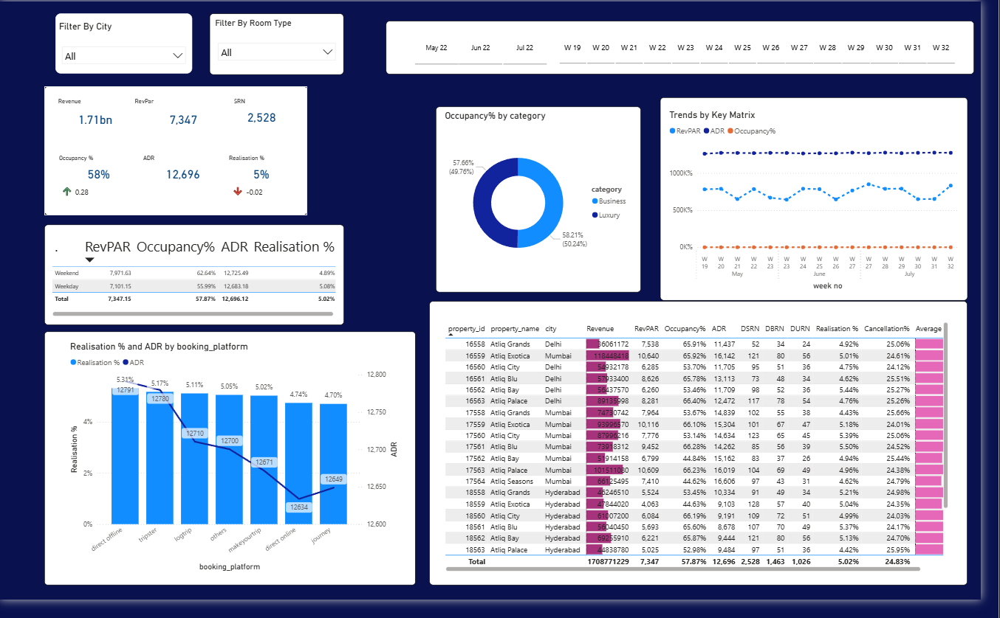
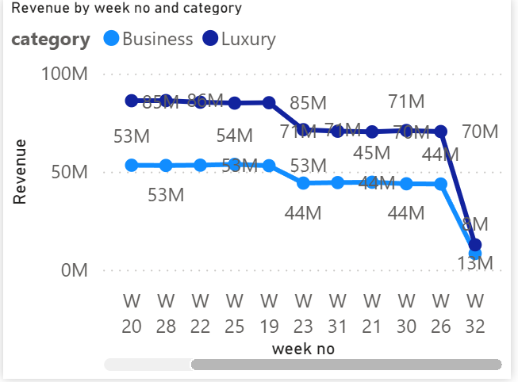

# Hospitality-Analytics-Dashboard

📊 Project Overview
This project presents an interactive Power BI dashboard designed for the hotel business (hospitality industry).
It analyzes performance across hotel properties in Delhi, Mumbai, and Hyderabad, focusing on KPIs such as:
Revenue (₹1.71B+ total)
Occupancy % (~58% average)
RevPAR (Revenue per Available Room)
ADR (Average Daily Rate)
Realisation % (~5%)
Cancellations (~25%)
The dashboard enables management to compare business vs luxury categories, evaluate booking platforms, and analyze weekly revenue trends, helping drive data-driven pricing and occupancy strategies.

## Key Insights  
- **Top-performing city:** Mumbai leads in revenue, followed by Delhi and Hyderabad.  
- **Luxury vs Business:** Luxury hotels command higher ADR but lower occupancy.  
- **Weekend vs Weekday:** Higher occupancy on weekends, indicating leisure-driven demand.  
- **Booking Channels:** Direct online bookings deliver stronger realisation percentages.  
- **Weekly Trends:** Luxury hotels contribute ~62% of revenue, with notable peaks such as Week 28.

---

## Dashboard Preview  

### Executive Overview  

### Weekly Revenue Trends  

*(Full dashboard available in the `.pbit` file.)*

---

## Tools & Techniques  
- **Power BI Desktop** – Design & visualization  
- **Power Query** – Data cleaning & transformation  
- **DAX** – KPI computations (e.g., RevPAR, ADR, Realisation %)  
- **Data Storytelling** – Translating metrics into strategic insights

---
### How to Use
1. Download `Hospitality-Analytics-Dashboard.pbit`.
2. Open in Power BI Desktop.
3. Connect your own dataset or use the provided sample CSVs.
4. Refresh → Interact with filters and visuals.

## Why This Project Matters  
Showcases how data analytics can enable actionable insights in the hospitality sector — from demand patterns and pricing strategy to channel effectiveness.

---

*This project demonstrates my proficiency in Power BI, data modeling, and strategic analytics.* 
